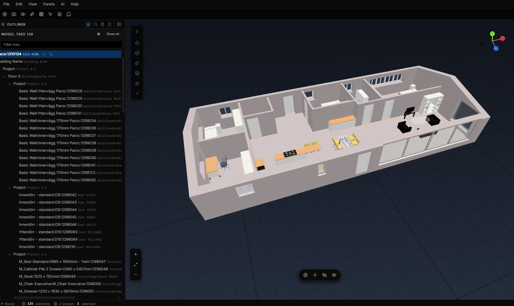

<h1 align="center">IFC Atlas</h1>

<p align="center">
  <strong>Open-source IFC viewer for visualizing and inspecting BIM models with built-in AI chat features.</strong><br>
</p>

<p align="center">
  
</p>

## Features

- **3D viewer.** Selection, isolate / hide, section planes, measurements, camera presets, saved viewpoints, share links.
- **Inspector.** Properties, quantities, model tree, search, command palette (`Ctrl+K`).
- **AI chat.** Multi-provider (OpenAI, Anthropic, OpenRouter) with structured tool calls that act directly on the 3D view.
- **Integrations.** buildingSMART IDS 1.0 validation, MCP client registry, and a built-in MCP server.
- **Deployment.** Desktop app, Docker self-hosting, or a browser-only demo.

Full feature catalogue and shortcuts: [`docs/user/FEATURES.md`](docs/user/FEATURES.md).

## Download

| OS | Download |
|---|---|
| **Windows** (10 / 11, x64) | [Installer (.exe)](https://github.com/nbharathik/ifc-atlas/releases/latest/download/IFC-Atlas-Setup-x64.exe) / [.msi](https://github.com/nbharathik/ifc-atlas/releases/latest/download/IFC-Atlas-x64.msi) |
| **Linux** (x86_64) | [.AppImage](https://github.com/nbharathik/ifc-atlas/releases/latest/download/IFC-Atlas-x86_64.AppImage) / [.deb](https://github.com/nbharathik/ifc-atlas/releases/latest/download/IFC-Atlas-amd64.deb) / [.rpm](https://github.com/nbharathik/ifc-atlas/releases/latest/download/IFC-Atlas-x86_64.rpm) |
| **macOS** | Not packaged yet; run from source below. |

Launch the app, add an AI provider key when prompted (optional; the viewer works without one), and drag in an `.ifc` file.

## Quick start (from source)

Requires Python 3.11 or 3.12 and Node.js 20+. Chat features need an API key from OpenAI, Anthropic, or OpenRouter.

```bash
git clone https://github.com/nbharathik/ifc-atlas.git
cd ifc-atlas

# Terminal 1: backend (http://localhost:8000)
cd backend && pip install -r requirements.txt && python run.py

# Terminal 2: frontend (http://localhost:5173)
cd frontend && npm install && npm run dev
```

Open <http://localhost:5173> in Chrome or Edge and drop an `.ifc` file onto the upload zone. API keys are set in-app on first launch, via environment variables, or in `~/.ifc-atlas/.env`. 

To run with Docker instead:

```bash
docker compose up --build
```

## Documentation

Getting started, features, the AI agent guide, self-hosting, desktop builds, and the API reference live under [`docs/`](docs/), published as a [documentation site](https://nbharathik.github.io/ifc-atlas/).

## Contributing

See [`CONTRIBUTING.md`](CONTRIBUTING.md) for setup, quality gates (`npm run verify`), and conventions, and [`docs/architecture/`](docs/architecture/) for the system design. Bug reports and feature requests: [GitHub Issues](https://github.com/nbharathik/ifc-atlas/issues).

## License

[Mozilla Public License 2.0](LICENSE).
